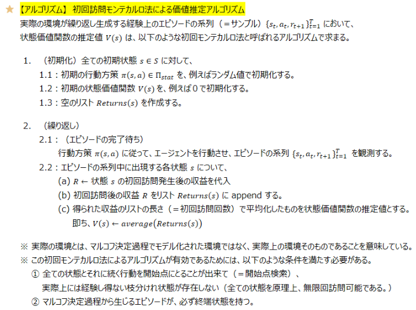
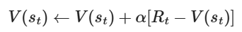
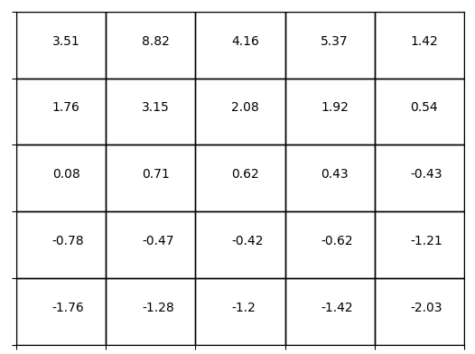

## ベルマン数値解

MDPが分かっている場合のコードをbellman-solution.pyに記載する

この時、報酬が以下のシチュエーション

```
r[0, 1, 0] = 1.0
r[0, 2, 0] = 2.0
r[0, 0, 1] = 0
r[1, 0, 0] = 1.0
r[1, 2, 0] = 2.0
r[1, 1, 1] = 1.0
r[2, 0, 0] = 1.0
r[2, 1, 0] = 0.0
r[2, 2, 1] = -1.0
```

結果：動き回ることがベストという結果

```
pi: [1, 1, 1]
v: [18.26914756 18.39679792 18.35569018]
q: [[18.66914756 17.35569018]
 [18.89679792 18.47695803]
 [18.35569018 16.43790567]]
```

報酬が以下のシチュエーション(在宅勤務が最高の場合)

```
r[0, 1, 0] = 1.0
r[0, 2, 0] = 1.0
r[0, 0, 1] = 4.0
r[1, 0, 0] = 5.0
r[1, 2, 0] = -1.0
r[1, 1, 1] = -1.0
r[2, 0, 0] = 3.0
r[2, 1, 0] = 0.0
r[2, 2, 1] = -1.0
```


結果：家なら家、それ以外の場合は移動をすることがベストな選択(ただし状態遷移は特定の確率に従う)

```
pi: [0, 1, 1]
v: [80.    75.025 79.   ]
q: [[73.029   80.     ]
 [77.525   70.27375]
 [79.      74.05   ]]pi: [0.5, 0.5, 1]
v: [20.81329984 21.19363712 20.77263485]
q: [[21.25396484 19.77263485]
 [21.25331898 21.13395527]
 [20.77263485 18.73400311]]
```


## モンテカルロ法による価値推定

モンテカルロ法とは、数値計算やシミュレーションなどにおいて、ランダムな乱数をサンプリングすることで数値計算（例えば、積分計算など）を行う手法の総称→ルコフ決定過程における価値関数の推定問題、方策評価と方策改善問題にも応用出来る。`<br>`

動的計画法と呼ばれる、マルコフ決定過程でモデル化された環境における価値関数のブートストラップ性を利用して、反復的に枝分かを辿りながら価値関数を計算していく手法は、モデルベースの強化学習手法であり、ベルマンの方程式に出てくる状態遷移関数 [](https://user-images.githubusercontent.com/25688193/50039765-09637080-007b-11e9-8694-e28e343c2bb7.png) が既知でなくてはならないという問題があった。`<br>`

実際の環境が繰り返し生成するエピソードの系列（＝サンプル）を利用して、経験的に価値関数を推定するため、この状態遷移関数が既知でなくてもよいというメリットが存在する。=モデルフリーの強化学習


動的計画法の各種手法は、マルコフ決定過程でモデル化した環境が、ベルマン方程式を満たすこと、更に、ベルマン方程式のブーストラップ性により、動的計画法の各種手法のバックアップ線図は、現在の状態行動対 (s,a)∈S×A →次回の状態行動対 (s′,a′)∈S×A で可能な遷移経路全てで分岐していた。

一方、モンテカルロ法では、（モデル化された環境ではなくて）実際の環境上で、１つのエピソードが繰り返し試行され、経験的に１つの経路が繰り返し試行されるだけなので、モンテカルロ法のバックアップ線図は、上図の太線部分で示された１つのエピソードの開始から終端までの１つのサンプリングされた経路となる。

ここで、状態価値関数は、
[](https://user-images.githubusercontent.com/25688193/50636865-059c7d00-0f9b-11e9-9c9f-5baa5479c22f.png)

期待利得に関する期待値で定義されるものであったことを考えると、モンテカルロ法で価値推定を行う場合には、実際の環境が生成するエピソードの系列に従って状態を訪問した後に観測した収益を平均化すれば良い

→より多くの訪問回数を重ねるにつれて、平均値が期待値に収束するようになる。

動的計画はバックアップ木全体を調べる

モンテカルロ法はバックアップ木の特定の経路を調べる

状態推移が不明なため、その時得られた報酬を割引しながら加算していくことで、トータルの報酬を評価することになる。ここが動的計画とは異なる。

##### 初回訪問モンテカルロ法による価値推定

[](https://github.com/Yagami360/My_NoteBook/blob/master/%E6%83%85%E5%A0%B1%E5%B7%A5%E5%AD%A6/%E6%83%85%E5%A0%B1%E5%B7%A5%E5%AD%A6_%E6%A9%9F%E6%A2%B0%E5%AD%A6%E7%BF%92_%E5%BC%B7%E5%8C%96%E5%AD%A6%E7%BF%92.md#-%E5%88%9D%E5%9B%9E%E8%A8%AA%E5%95%8F%E3%83%A2%E3%83%B3%E3%83%86%E3%82%AB%E3%83%AB%E3%83%AD%E6%B3%95%E3%81%AB%E3%82%88%E3%82%8B%E4%BE%A1%E5%80%A4%E6%8E%A8%E5%AE%9A)

初回訪問モンテカルロ法は、あるエピソードにおいて、状態 s への初回訪問の結果で発生した収益のみを平均値するアルゴリズムで、以下のようになる。
※ このアルゴリズムは、状態価値関数の推定を行っているだけで、方策評価と方策改善は行っていないことに注意。



## TD学習

##### 経緯

動的計画法とモンテカルロ法との違いはブートストラップを使えるかどうか。

この違いは状態遷移確率があるかどうかということが違いとなる。

※動的計画法は次の状態を推定できるため、ブートストラップ可能といえます。

他方、モンテカルロ法はサンプリングを行いエピソードを生成し、得られた収益を平均することで価値関数の期待値計算を行う。

MC法ではサンプリングに基づいてエピソードを生成し、得られた収益を平均することで価値関数の期待値計算をおこないます。

この方法では環境に対する知識を必要とせず、得られた報酬およびその総和としての収益をメモリに貯めていけば良いのでした。しかし、エピソードが終了するまで待たなければならないこと、また報酬のみを扱うためブートストラップを使わないことがネックでした。

**TD学習**は動的計画法とモンテカルロ法の両要素を取り入れた手法。

=環境に関する知識を必要とせずにエピソードを前進させつつ、ブートストラップにより逐次（エピソード終端まで待たずに）価値関数を更新可能な手法



直近の価値関数の推定値を用いるTD法を**TD(0)法**。

## TD learner



## モデルフリー

モデルフリー＝状態遷移確率が不明なモデル

この場合、p(s|s,a)が不明なので価値関数からQtを求めることは不可能

1. 価値ベースアプローチ：行動価値関数をモンテカルロ/TDによって推定→最適行動を選定する
2. 方策ベースアプローチ：方策の条件付き確率πを直接に推定して、価値関数の推定値による方策評価を参考に方策を改善する

価値関数によって方策探索に反映する方法はActor-Critic法＝価値ベースに方策ベースのハイブリッドなアプローチ。

## Q関数による制御

環境モデルが未知で、観測された状態行動系列に沿ってQ関数を推定するしかない、Q関数についてgreedyが最適であることは保証されない。

探索の活用：探索結果から計算された報酬期待値Q(a)が最大である行動を選択する手法

Q関数

> ＝行動価値関数
>
> Q = Q(s, a)
>
> 基本的に状態と行動から考えられる価値を示す
>
> この関数を最大化するように行動は選択していくことが基本路線
